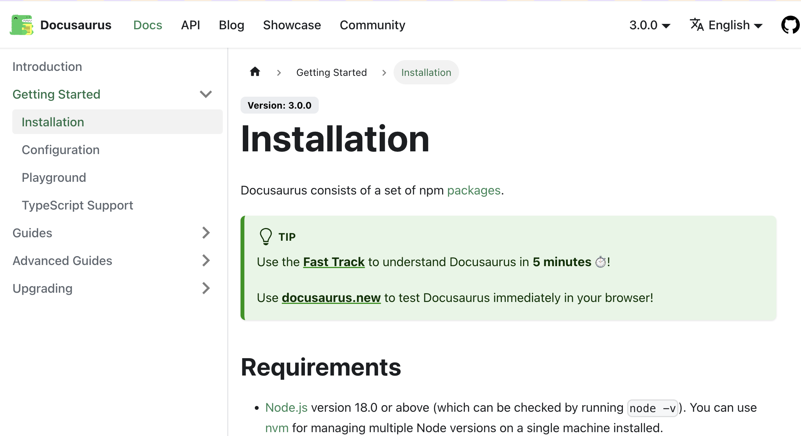

[Docusaurus](https://docusaurus.io) is a great tool to set up documentations for a software project, set of features included such as a homepage, documentations, blogs. etc. Docusaurus is simple to use, requires a little Javascript skills to install, develop more functions. Contents in Docusaurus are composed by [Markdown](https://www.markdownguide.org) or [MDX](https://mdxjs.com), friendly markup languages. For a plus, it is developed by Meta team, this ensures for long-term maintenance.

To see how great this tool is, visit [Docusaurus](https://docusaurus.io) homepage, that is exactly what this tool can do for you easily. Of course, my simple blog you are reading here is also done by Docusaurus. 


## Install {#install}

To install a project with Docusaurus, you need Node.js version 18.0 or above installed. Then run the following command to scaffold the project bundled with sample data:

```bash
npx create-docusaurus@latest my-website classic --typescript
```

Edit files in `/blog`, `/docs`, or `/src/pages` (homepage) with Markdown language, then preview changes.

## Run on Development {#run-develop}

To run the website at your local development and watch changes:

```bash
cd my-website
npm run start
```

## Run on Production {#run-production}

Create an account at [GitHub pages](https://pages.github.com) or [Vercel](https://vercel.com), then hook it to your Github repository, and everything is deployed automatically. Basically, these hosting providers proceed building code and start services for you. I prefer Vercel because it is super easy in deployment with SSL support and domain linking. 

```bash
npm run build
```

For code of my simple blog, you can [check here](https://github.com/luong/blog) and feel free to give me any feedback. Thank you.


