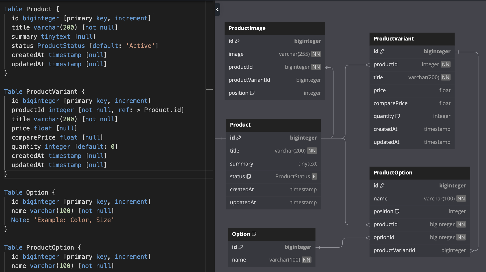

Looking for a tool to design database of my new project, I found out a great one in the ninche, that's [DbDiagram](https://dbdiagram.io/). It is really simple to use, designed by [DBML](https://dbml.dbdiagram.io/docs) and exported to MySQL / PostgreSQL or SQL Server in one second. Certainly you can learn and start your database design with DbDiagram in less than ten minutes.

DbDiagram stores your design files on cloud. For free version, they do public our designs. In case you want them in private, just pay ~$9 per month. In addition, you can collaborate with your team by purchasing team plan.

